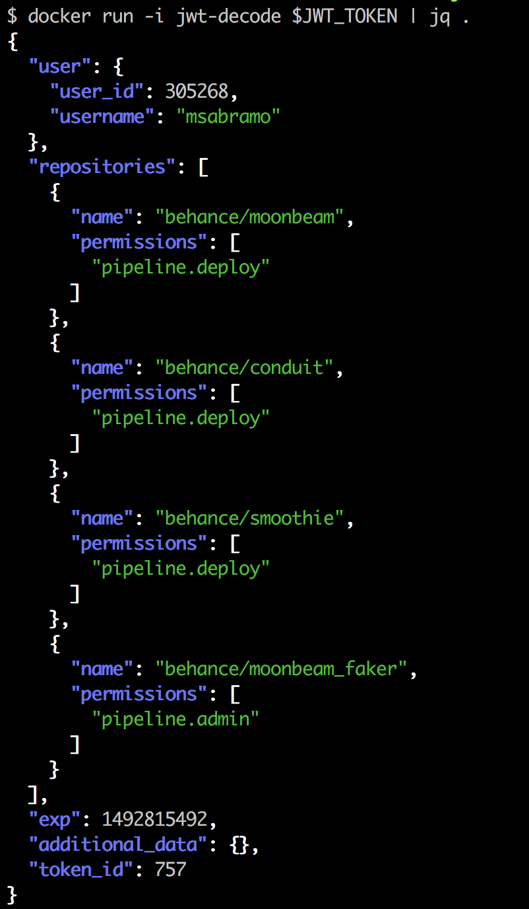

# jwt_decode
CLI for quick and dirty decoding of JWTs (JSON Web Tokens)

Easiest way to run this is with the [Docker image](https://hub.docker.com/r/msabramo/jwt_decode/).

```
$ docker run jwt-decode $JWT_TOKEN
{
    "user": {
        "user_id": 305268,
        "username": "msabramo"
    },
    "repositories": [
        {
            "name": "behance/moonbeam",
            "permissions": [
                "pipeline.deploy"
            ]
        },
        {
            "name": "behance/conduit",
            "permissions": [
                "pipeline.deploy"
            ]
        },
        {
            "name": "behance/smoothie",
            "permissions": [
                "pipeline.deploy"
            ]
        },
        {
            "name": "behance/moonbeam_faker",
            "permissions": [
                "pipeline.admin"
            ]
        }
    ],
    "exp": 1492815492,
    "additional_data": {},
    "token_id": 757
}
```



To make this easier, you could even add something like this to one of your dotfiles, such as `~/.profile`:

```bash
jwt_decode() { docker run jwt-decode "$@"; }
```
